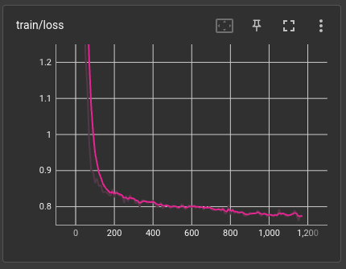
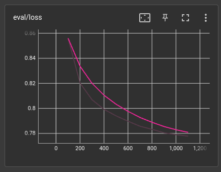
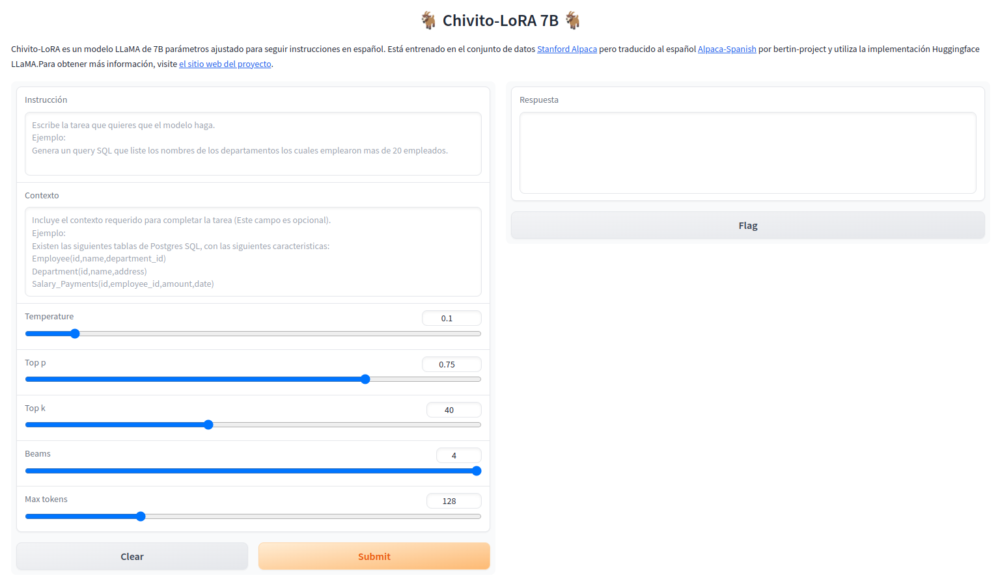

<p align="center" width="100%">

</p>


# 🐐 Chivito-LoRA 🐐

Este repositorio está destinado a compartir todos los pasos y recursos que use para afinar una versión de LLaMA empleando una versión en español del dataset Alpaca.

- 🤗 **Disponible el modelo [aqui](https://huggingface.co/CristianC/chivito_lora_alpaca_es_7b).**

## Data

Se uso [alpaca-spanish dataset](https://huggingface.co/datasets/bertin-project/alpaca-spanish), el cual es una traducción de [alpaca_data.json](https://github.com/tatsu-lab/stanford_alpaca/blob/main/alpaca_data.json) y cuenta con cerca de 50k ejemplos de peticiones hechas a ChatGPT que van desde preguntas de conocimiento general hasta programación en diversos lenguages como Python, Java, etc.

## Instrucciones

Para el fine-tunning del modelo se tomo como referencia el codigo de [Alpaca Lora](https://github.com/tloen/alpaca-lora) (tambien fue usado [Cabrita](https://github.com/22-hours/cabrita)), que proporcionan las herramientas necesarias para ajustar el modelo LLaMA. 

Para ejecutar los códigos presentes en este repositorio se recomienda emplear el contenedor de docker el cual cuenta con todo lo necesario para ejecutarlos, para esto se recomienda tener instalado las siguientes herramientas (Las versiones especificadas fueron las empleadas):

* Docker v20.10.22
* Docker compose v1.29.2
* [Nvidia-docker](https://docs.nvidia.com/datacenter/cloud-native/container-toolkit/install-guide.html)

Luego de esto solo es necesario ejecutar el script **start_env.sh** el cual hará todo lo necesario para construir y desplegar el contenedor de docker de desarrollo (el script **close_env.sh** sirve para detener y eliminar el contenedor cuando ya no sea requerido).

## Resultados

El tiempo requerido para él fine-tunning del modelo Llama 7B fue de aproximadamente de 8 horas empleando una GPU RTX 3090 Ti.

<div style="text-align:center;">
  
  
</div>

Y al evaluar el modelo se obtuvieron los siguientes resultados (Los resultados se comparan con ChatGPT 3.5):

| **Entrada**  | **Chivito 7B**  | **ChatGPT**  |
|----------|-------------|----------|
| Nombra las capitales regionales de Colombia | Las capitales regionales de Colombia son Bogotá, Medellín, Cali, Barranquilla, Cartagena de Indias, Bucaramanga, Cúcuta, Ibagué, Tunja, Pereira, Villavicencio, Montería, Neiva, Popayán, Santa Marta, Valledupar, Cúcuta, San Andrés y Providencia.  | Claro, las capitales regionales de Colombia son las siguientes: Bogotá D.C, Medellín, Cali, Barranquilla, Bucaramanga, Manizales, Neiva, Villavicencio, Pasto, Tunja.|
| Que son los chivos?  |  Los chivos son animales de la familia de los cérvidos. Son herbívoros que se alimentan principalmente de hierba y hojas. Los chivos son animales sociales que viven en manadas y tienen una vida promedio de 10 a 15 años. |  El chivo es un animal mamífero rumiante que pertenece a la familia de los bóvidos. Es un animal domesticado que se utiliza principalmente para producir carne, leche y piel. Los machos del chivo se llaman "cabras" y las hembras se llaman "chivas". El chivo tiene cuernos que pueden ser cortos o largos, dependiendo de la raza y el sexo del animal. Su cuerpo es delgado y musculoso, con una altura promedio de 80 a 90 centímetros y un peso promedio de 45 a 70 kilogramos. El chivo es un animal resistente y adaptable, capaz de sobrevivir en diferentes tipos de terrenos y climas. |
| Traduce la frase 'Hello! how are you?' al español  |  ¡Hola! ¿Cómo estás? |  La frase "Hello! how are you?" se traduce al español como "¡Hola! ¿cómo estás?" | 
| Escribe un haiku sobre la comida  |  Mi plato favorito, Cocinado con amor y cariño, Es tan delicioso. | Una brisa suave, aroma de comida fresca, el estómago ruge.  | 

---


### Codigo:

**Entrada**:

Existen las siguientes tablas de Postgres SQL, con las siguientes caracteristicas:

* Employee(id,name,department_id)
* Department(id,name,address)
* Salary_Payments(id,employee_id,amount,date)

Genera un query SQL que liste los nombres de los departamentos los cuales emplearon mas de 20 empleados.

**Chivito 7B**:

```sql
SELECT department.name, COUNT(employee.id)
FROM department
JOIN employee ON employee.department_id = department.id
GROUP BY department.name
HAVING COUNT(employee.id) > 20;
```

**ChatGPT**:

El query SQL para listar los nombres de los departamentos que emplearon más de 20 empleados sería el siguiente:

```sql
SELECT Department.name
FROM Department
JOIN Employee ON Employee.department_id = Department.id
GROUP BY Department.id, Department.name
HAVING COUNT(Employee.id) > 20;
```

---
**Entrada**:

Escribe un programa de Python que imprima los primeros 24 números de Fibonacci

**Chivito 7B**:

```python
def fibonacci(n):
    if n == 0:
        return 0
    elif n == 1:
        return 1
    else:
        return fibonacci(n - 1) + fibonacci(n - 2)

print(fibonacci(24))
```

**ChatGPT**:

Claro, aquí te dejo un programa de Python que imprime los primeros 24 números de la secuencia de Fibonacci:
```python
# Define una función para calcular los números de Fibonacci
def fibonacci(n):
    if n <= 1:
        return n
    else:
        return fibonacci(n-1) + fibonacci(n-2)

# Imprime los primeros 24 números de Fibonacci
for i in range(24):
    print(fibonacci(i))
```

---
**Entrada**:

Escriba un programa en java que imprima los números del 1 al 100. Pero para los múltiplos de tres, escriba 'Fizz' en lugar del número y para los múltiplos de cinco, escriba 'Buzz'. Para números que son múltiplos de tres y cinco, escriba 'FizzBuzz'.

**Chivito 7B**:

```java
public class FizzBuzz {
    public static void main(String[] args) {
        for (int i = 1; i <= 100; i++) {
            if (i % 3 == 0 && i % 5 == 0) {
                System.out.println("FizzBuzz");
            } else if (i % 3 == 0) {
                System.out.println("Fizz");
            } else if (i % 5 == 0) {
                System.out.println("Buzz");
```

**ChatGPT**:

¡Por supuesto! Aquí te dejo un programa en Java que imprime los números del 1 al 100, pero para los múltiplos de tres, escribe 'Fizz', para los múltiplos de cinco, escribe 'Buzz' y para los múltiplos de tres y cinco, escribe 'FizzBuzz':

```java
public class FizzBuzz {
    public static void main(String[] args) {
        for (int i = 1; i <= 100; i++) {
            if (i % 3 == 0 && i % 5 == 0) {
                System.out.println("FizzBuzz");
            } else if (i % 3 == 0) {
                System.out.println("Fizz");
            } else if (i % 5 == 0) {
                System.out.println("Buzz");
            } else {
                System.out.println(i);
            }
        }
    }
}
```
---


## Live Demo

Para ejecutar un demo en tiempo real se dispone del script de python **gradio_chivito_7b.py** el cual cuenta con lo necesario para desplegar un demo en gradio en el cual se puede interactuar de una mejor manera con el modelo.

<p align="center" width="100%">

</p>


## Próximos pasos

* Buscar mejores de evaluación del modelo.
* Entrenar con modelos mas grandes.
* Integración con servicios externos (a.k.a Plugins) 👀


## Referencias

Si he visto más, es poniéndome sobre los hombros de Gigantes. **-Isaac Newton**

 [LLaMA](https://ai.facebook.com/blog/large-language-model-llama-meta-ai/), [Stanford Alpaca](https://github.com/tatsu-lab/stanford_alpaca), [Alpaca Lora](https://github.com/tloen/alpaca-lora), [Cabrita](https://github.com/22-hours/cabrita), [Bertin](https://huggingface.co/bertin-project), [ChatGPT](https://openai.com/blog/chatgpt) y [Hugging Face](https://huggingface.co/).
 
 Ojala te sea de utilidad este proyecto y aprendas tanto como yo al hacerlo.
 


